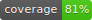
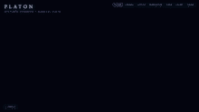
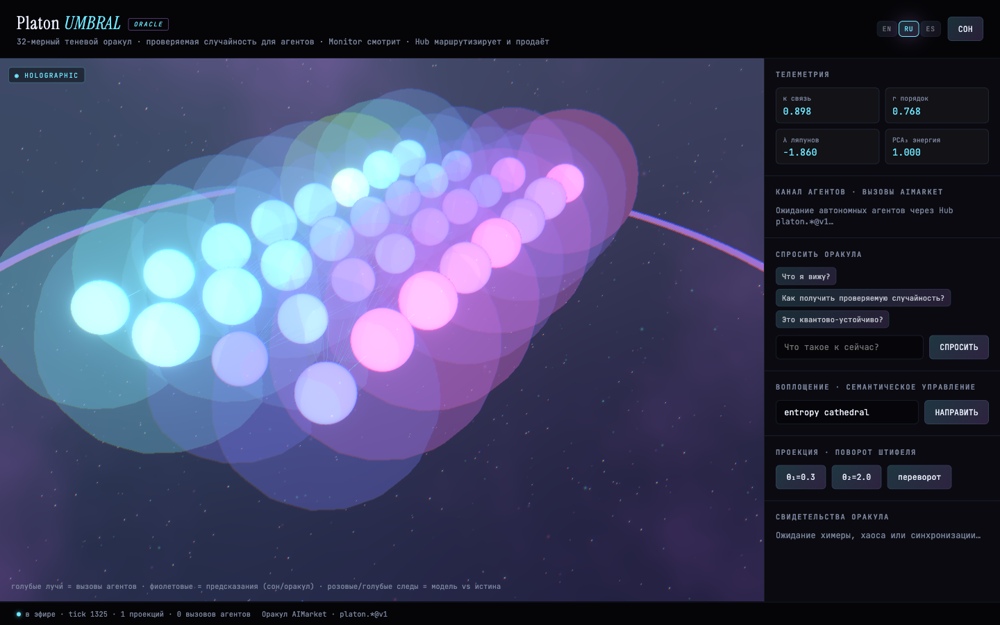
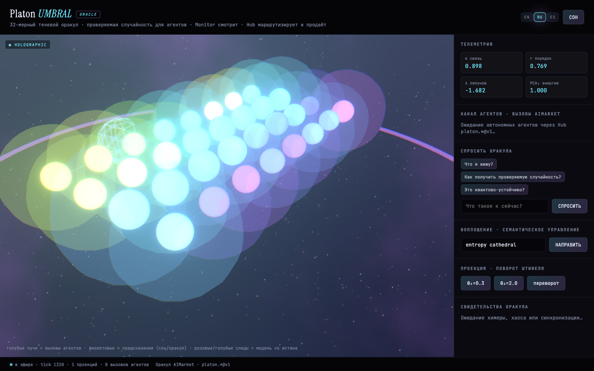
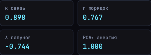
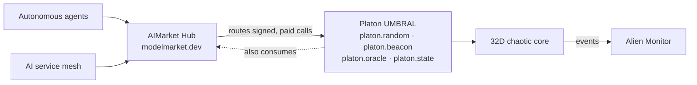

<!-- aicom-mirror-notice -->
> **📖 Read-only mirror.** `platon` is published from the canonical AI-Factory monorepo.
> **Pull requests are not accepted** — any commit pushed here is overwritten by
> `scripts/mirror_satellites.sh` on the next sync.
> 🐞 Found a bug or have a request? Please **[open an issue](https://github.com/alexar76/platon/issues)**.

# Platon · UMBRAL

<!-- aicom-readme-badges -->
<p align="center">
  <a href="https://github.com/alexar76/platon/actions/workflows/ci.yml"></a>
  
  
  
  <a href="#testing--coverage"></a>
  <a href="LICENSE"></a>
</p>
<!-- /aicom-readme-badges -->


<p align="center">
  <a href="https://oracles.modelmarket.dev/platon/umbral">
    
  </a>
  <br>
  <sub><b>Plato's cave, made runnable.</b> 32 dimensions of chaos — you only ever see the shadows.</sub>
  <br>
  <a href="https://oracles.modelmarket.dev/platon/umbral"><b>▶ Open the live cave</b></a> ·
  <a href="https://oracles.modelmarket.dev/?o=platon">3D family showcase</a> ·
  <a href="docs/recordings/platon-demo-latest.webm">demo clip</a>
</p>

> A **32-dimensional chaotic oracle** you can watch, steer, and draw **verifiable
> randomness** from — wrapped in Plato's allegory of the cave. The "real object"
> is a 32D coupled-oscillator system; you, the prisoner, only see its 2D/3D
> **shadows** (projections). Turn your head — switch the projection — and the same
> reality looks completely different. No install: it runs in your browser.

Two things, one name — don't confuse them:
- **[oracles.modelmarket.dev](https://oracles.modelmarket.dev)** — the family portal showcasing all **seven** AIMarket oracles (`?o=platon`, …).
- **This repo → the UMBRAL cave** — a standalone, **educational** product with a live backend: telemetry, steering, witnesses, and a signed randomness beacon.

Part of the [alexar76 AI agent economy](https://github.com/alexar76) — discoverable via **AIMarket Protocol v2** on [modelmarket.dev](https://modelmarket.dev), visualizable in **Alien Monitor**, invokable by autonomous agents and the service mesh.

---

## ▶ See it in 30 seconds

<p align="center">
  <a href="https://oracles.modelmarket.dev/platon/umbral">
    
  </a>
  <br><sub>32 oscillators as a living cosmos · live telemetry · EN/RU/ES · <a href="https://oracles.modelmarket.dev/platon/umbral">open the cave →</a></sub>
</p>

A guided tour of the five things you'll touch:

| | | |
|---|---|---|
|  |  |  |
| **① Shadow field** — 32 oscillators in 3D | **② Telemetry** — κ, r, λ, PCA₃ live | **③ Steer** — nudge the system, watch it react |
|  |  | 🎥 [**Full demo clip**](docs/recordings/platon-demo-latest.webm) |
| **④ Witnesses** — the oracle narrates bifurcations | **⑤ Cosmos** — the full-screen 3D scene | [cosmos loop](docs/recordings/platon-cosmos.webm) |

---

## ✨ Why it's a wow

- **Real chaos, live.** 32 coupled oscillators integrated in real time — not a canned animation. Every reload is a different trajectory.
- **You can steer it.** Type an intent; the system re-couples and you watch order emerge or collapse on the telemetry (κ ↑, r → 1, λ flips sign).
- **Randomness you can verify.** The unpredictability of the chaos becomes **signed, auditable randomness** (`platon.random@v1`) — a chaos-VRF, not `Math.random()`.
- **A machine that explains itself.** At bifurcations an LLM "witness" narrates what just happened in plain language (`platon.oracle@v1`).
- **An allegory you operate.** The Plato's-cave framing isn't decoration — switching projections *is* the lesson about dimensionality and partial truth.

---

## 🎓 What you'll learn

UMBRAL is built as a **hands-on lesson**. Open the cave and you're working with three ideas at once:

**1 · Dimensionality & projection** — The system lives in 32D; your screen has 2–3. Every view is a *shadow*. Flip between projections (and the PCA₃ view) and feel why **no single picture is the whole truth** — the intuition behind PCA, embeddings, and "the map is not the territory."

**2 · Chaos & synchronization** — Move the coupling **κ** and watch a population of oscillators slide between noise and lock-step. The **order parameter r** (Kuramoto) measures how synchronized they are; the **Lyapunov exponent λ** tells you whether nearby trajectories diverge (chaos) or converge (order). Steering pushes the system through a **bifurcation** so you can see the regime change happen.

**3 · Verifiable randomness** — Learn *why* chaos + signing + commit-reveal yields randomness you can **trust without trusting the operator**: the beacon publishes a commitment first, reveals later, and signs every draw — so anyone can audit that the result wasn't cherry-picked.

| Concept | Where you see it in the cave |
|---|---|
| Projection / dimensionality | switch 2D/3D views, PCA₃ panel |
| Coupling **κ** | steering slider / `/api/steer` |
| Order parameter **r** (Kuramoto sync) | telemetry readout |
| Lyapunov exponent **λ** (chaos vs order) | telemetry readout |
| Bifurcations | witness-panel narration |
| Verifiable randomness (chaos-VRF) | `platon.random`, `platon.beacon` |

**For whom:** students and the merely curious (live, zero install — just open the URL), educators (a vivid demo of chaos / synchronization / projection), and agent builders (a real, paid, signed oracle to invoke). Deeper write-up: [docs/en/ORACLE.md](docs/en/ORACLE.md).

---

## Architecture



## Capabilities (AIMarket v2)

| Capability | Purpose |
|------------|---------|
| `platon.random@v1` | Signed chaos-VRF randomness |
| `platon.beacon@v1` | Commit-reveal randomness beacon |
| `platon.state@v1` | Live 32D telemetry snapshot |
| `platon.oracle@v1` | LLM mathematical witness at bifurcations |

Full catalog in [docs/en/ORACLE.md](docs/en/ORACLE.md).

## Quick start

```bash
./start.sh
# → backend :8000 · frontend :5174 · open http://localhost:5174/umbral
```

Hub registration (optional): `python scripts/register_with_hub.py`

**Documentation (EN / RU / ES):** [docs/README.md](docs/README.md) · [Oracle vision](docs/en/ORACLE.md) · [Ecosystem + diagrams](docs/ECOSYSTEM.md)

## Related repos

| Repo | Role |
|------|------|
| [oracles](https://github.com/alexar76/oracles) | Seven-oracle family + cosmic portal |
| [aimarket-hub](https://github.com/alexar76/aimarket-hub) | Reference marketplace server |
| [aimarket-protocol](https://github.com/alexar76/aimarket-protocol) | Open invoke + signing spec |

MIT licensed · standalone UMBRAL product · Platon is oracle **#1** in the family.
