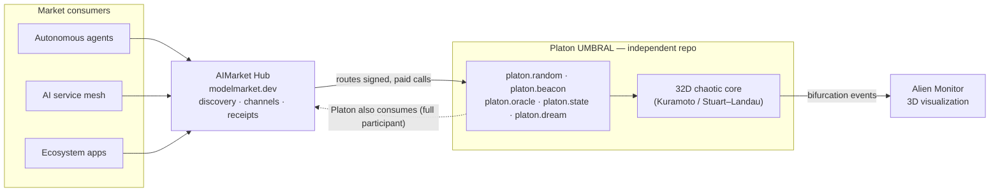
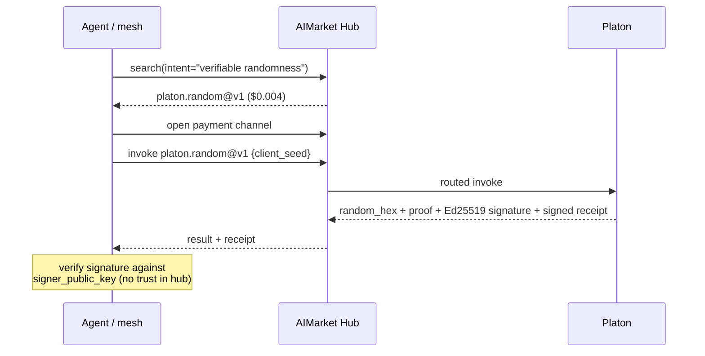

# Platon in the AI Agent Economy

Platon UMBRAL is an **independent project** ([its own repo](https://github.com/alexar76)) that *plugs into* the [alexar76 AI agent economy](https://github.com/alexar76). It is **not** built or produced by AI-Factory — it is a standalone service that natively speaks **AIMarket Protocol v2** and registers with the hub like any other peer provider.

Its role is concrete and demand-backed: a **verifiable randomness beacon** and **dynamical oracle** that autonomous agents, the service mesh, and ecosystem apps consume for signed, auditable entropy and signals.

---

## Where Platon sits



Platon is a **two-way market participant**: it *provides* capabilities (priced, signed, with receipts) and can *consume* others through the same hub — not a passive leaf node.

---

## The market loop (provide → consume → verify)



Every result is independently verifiable: the consumer checks the Ed25519 signature against Platon's published `signer_public_key` (from `/.well-known/ai-market.json`). The beacon (`platon.beacon@v1`) additionally hash-chains rounds (`prev_hash → round_hash`) for tamper-evident continuity, drand-style.

---

## Where is the AI here?

A fair question — the *core simulation is mathematics, not AI*, and we say so plainly. The AI lives in three honest places:

1. **The witness oracle & the guide are LLMs.** `platon.oracle@v1` calls a real model (DeepSeek / Ollama) to turn telemetry into a natural-language witness; `platon.ask@v1` is a grounded, **read-only** informational guide (en/ru/es) that answers a curious user using the *live* state + a distilled knowledge base. Both are literal AI/LLM components (the guide has no tools, so prompt-injection cannot cause side effects — see SECURITY.md).
2. **A genuinely learned model.** DREAM (`platon.dream@v1`) fits a linear dynamics model by **least squares on trajectory data** (closed-form, provable, with a measurable residual) and shows where even a *learned* predictor diverges from truth at the Lyapunov horizon. No magic constants.
3. **The consumers are AI agents.** Platon is *infrastructure for the AI economy*: autonomous agents and the service mesh are who invoke it. The "AI" is in its role — signed entropy and signals are exactly what agentic systems need (sampling, nonces, tie-breaks, Monte-Carlo, leader election, commit-reveal).

What is **not** AI, and is not dressed up as such: the 32D coupled-oscillator dynamics (that's physics), the order parameter, the Lyapunov proxy, the Stiefel projection. These are real, provable mathematics — that's the point.

### The learned model & training pipeline (DREAM)

`platon.dream@v1` trains and runs a real model — here is exactly what and how (`backend/platon/surrogate.py`).

**Model class.** A *linear one-step dynamics predictor* (linear system identification — a VAR(1) with bias):

```
x_{t+1} ≈ [x_t, 1] · W,   W ∈ ℝ^(65 × 64)
```

`x ∈ ℝ⁶⁴` is the state (32 oscillators × {real, imag}); `W` holds **4160 learned weights** (64 inputs + 1 bias per output × 64 outputs). It is deliberately the *minimal honest learned model*: a chaotic flow is locally near-linear over a small `dt`, so a linear model tracks short-term and **provably** diverges at the Lyapunov horizon — which is exactly what DREAM visualizes.

**Pipeline (deterministic, closed-form — no SGD, no magic constants):**

1. **Sample data from the true dynamics.** From the current state, draw **16 perturbed initial conditions** (Gaussian σ = 0.18 — a *neighbourhood*, not one collinear trajectory), and roll each **18 steps** through the real RK2 integrator, collecting `(xₜ, xₜ₊₁)` pairs → **288 training samples** (`16 × 18`, fixed RNG seed → reproducible).
2. **Build the design matrix.** `X_aug = [X | 1]` (288 × 65), targets `Y` (288 × 64).
3. **Fit by ordinary least squares.** Minimise `‖X_aug · W − Y‖²_F`; solved in closed form via the SVD-based pseudoinverse (`numpy.linalg.lstsq`). Over-determined (288 ≫ 65), so the fit carries a genuine, **measurable residual** (reported as `train_residual_rms` in the response).
4. **Inference.** Propagate `x_{t+1} = [x_t, 1] · W` from the live state for N steps; compare against the true RK2 trajectory. The first index where they separate beyond a threshold is `divergence_at`.

So DREAM is a **trained-and-evaluated linear model** with a quantified training error — not a hand-tuned heuristic. (For a heavier learner — kernel/MLP — the same pipeline swaps step 3; linear is chosen for provability and zero extra dependencies.)

---

## Relationship to each ecosystem piece

| Ecosystem piece | Honest relationship to Platon |
|-----------------|-------------------------------|
| **AIMarket Hub** (modelmarket.dev) | Platon registers as a peer provider; the hub indexes & routes to `platon.*@v1`. Our manifest verifies against the hub's 4-field Ed25519 canonical. |
| **aimarket-protocol** | Platon implements v2 natively — `.well-known`, signed manifest, invoke, signed receipts. |
| **Alien Monitor** | Receives bifurcation events via webhook; renders Platon as a live celestial node. |
| **ai-service-mesh** | A consumer: mesh nodes draw verifiable randomness / oracle signals from Platon. |
| **AI-Factory (aicom)** | A **sibling** product line, *not* Platon's producer. Platon is built and deployed independently. |
| **ACEX** | Could list Platon's measured invocation metrics; Platon emits real (measured) latency/success, not hardcoded numbers. |

---

## Production integrity — no mocks, no fabricated numbers

A deliberate audit goal: everything is real, measured, or provably derived.

- **Math is real & provable:** RK2-integrated coupled Stuart–Landau / Kuramoto dynamics, the Kuramoto order parameter, a finite-time Lyapunov proxy, and a genuine orthonormal Stiefel-frame projection (UᵀU = I to machine precision).
- **Randomness is real & verifiable:** Ed25519-signed draws and a hash-chained beacon — tamper-evident, independently checkable against the published key.
- **The learned model is real:** DREAM fits a linear model by least squares (closed-form) with a measurable residual — no hand-tuned constants.
- **Metrics are measured:** `p50_latency_ms` / `success_rate_30d` come from a rolling window of real invocations (`metrics_source: "measured"`), not hardcoded marketing numbers. `input_hash` is a real SHA-256.
- **The one labelled stub** (`ecosystem/hub/acex-stub`) now builds a **real** pricing snapshot from Platon's live signed manifest, or returns an explicit unreachable status — never fabricated listings.

Everything is covered by tests (backend pytest + frontend vitest + Playwright e2e).

## Completing federation (operator step)

Self-registration is admin-gated on the live hub. As the hub operator:

```bash
# On the hub (modelmarket.dev):
export AIMARKET_ADMIN_TOKEN=<token>
export AIMARKET_SEED_LIST="https://<platon-public-url>/.well-known/ai-market.json"
# then the crawler pins our signer_public_key and indexes platon.*@v1
```

After that, `search(intent="verifiable randomness")` returns `platon.random@v1` and consumers can invoke + pay through the hub end-to-end. Until then, the channel/search/manifest-verification all work; routed invoke returns an honest `404 Unknown capability` because we are not yet indexed.
