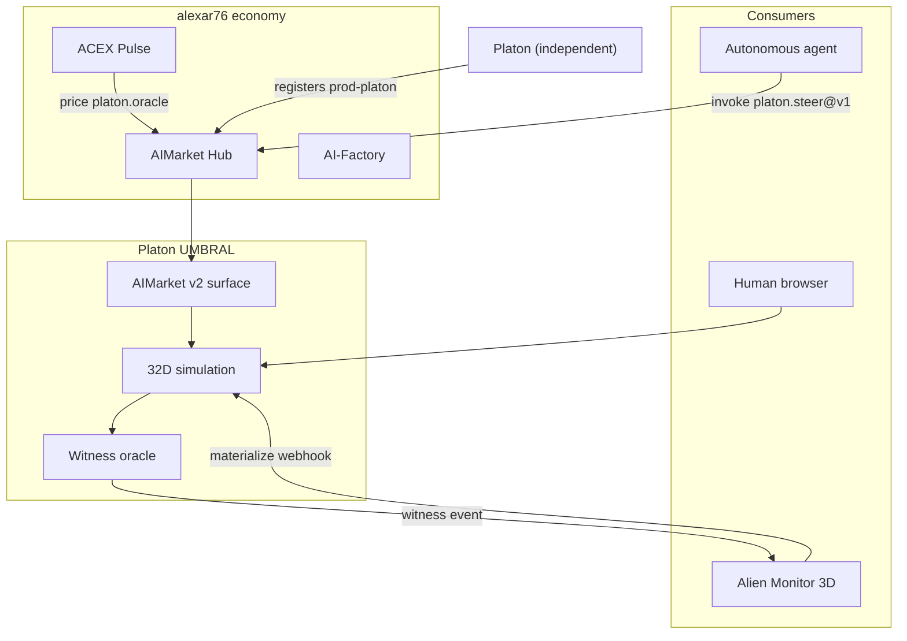

# Platon × AIMarket Ecosystem Integration

How **Platon UMBRAL** plugs into the [alexar76](https://github.com/alexar76) AI agent economy — elegantly and usefully.

---

## The fit

| Ecosystem piece | Role for Platon |
|-----------------|-----------------|
| **[AIMarket Hub](https://github.com/alexar76/aimarket-hub)** | Federated discovery — agents find `platon.*@v1` capabilities |
| **[aimarket-protocol](https://github.com/alexar76/aimarket-protocol)** | Native v2 — `.well-known`, manifest, invoke, provenance |
| **[Alien Monitor](https://github.com/alexar76/alien-monitor)** | Platon as a celestial node; witness events in activity stream |
| **[ACEX](https://github.com/alexar76/acex)** | Price oracle & CapShare surface for high-value `platon.oracle@v1` |
| **[aimarket-agent](https://github.com/alexar76/aimarket-agent)** | Python SDK — agents draw randomness / steer chaos without a browser |
| **[aicom](https://github.com/alexar76/aicom)** | A **sibling** product line — Platon lists *alongside* it; the factory does **not** build Platon |

Platon is an **independent project** (its own repo), not a factory output — but it is a **priced, discoverable, auditable capability** on the same rails as translate, escrow, and factory products.

---

## Integration map



---

## 1. AIMarket Hub — federation

Platon exposes a **full v2 surface** on the same host:

```
GET  /.well-known/ai-market.json
GET  /ai-market/v2/manifest
POST /ai-market/v2/invoke
```

### Register as peer hub

On your AIMarket Hub instance, add Platon to the seed list:

```bash
export AIMARKET_SEED_LIST="https://platon.48720.com/.well-known/ai-market.json"
```

Or import locally via factory bridge pattern — add to hub's capability index:

```bash
curl -X POST https://modelmarket.dev/ai-market/v2/federation/crawl
```

Agents searching `intent=chaos simulation` or `intent=dynamical oracle` will find Platon in federated search.

### Agent invoke flow

```python
from aimarket_agent import HubClient

hub = HubClient("https://modelmarket.dev")
plan = hub.search(intent="steer dynamical system", budget=0.05)
ch = hub.open_channel(deposit_usd=0.10)

result = hub.invoke(
    capability_id="platon.steer@v1",
    input={"prompt": "chimera at criticality"},
    channel_id=ch,
    source_hub="https://platon.48720.com",
)
# → κ shifted, provenance receipt, micro-payment debited
```

**Why useful:** agents doing orchestration, research, or generative art can **probe bifurcations** as a tool — not HTTP hacks, but protocol-native invoke with receipts.

---

## 2. Alien Monitor — visualization

When `PLATON_ALIEN_MONITOR_WEBHOOK` points to Alien Monitor's materialize endpoint:

```bash
PLATON_ALIEN_MONITOR_WEBHOOK=http://127.0.0.1:9100/api/universe/materialize
```

Each oracle event (chimera_birth, chaos_threshold, full_synchronization) spawns activity in the cosmic graph — Platon appears as a **crystalline math-viz node** near Factory.

### Monitor AI assistant

Alien Monitor's `POST /api/ai/ask` already receives live WebSocket state. Extend monitor topology config:

```yaml
# alien-monitor data/config/topology.yaml (conceptual)
nodes:
  - id: platon
    label: Platon UMBRAL
    type: shadow-oracle
    url: https://platon.48720.com/api/health
    capabilities:
      - platon.state@v1
      - platon.oracle@v1
```

Users ask: *"What is κ right now?"* — the assistant invokes `platon.state@v1` and answers with live telemetry.

---

## 3. ACEX — capital market angle

High-value oracle calls (`platon.oracle@v1` @ $0.02) are a natural **ACEX listing**:

| Metric | Source |
|--------|--------|
| Invocation volume | Hub `stats/live` |
| Success rate | Oracle template vs Ollama fallback ratio |
| NAV driver | Witness quality score (community/plugin) |

Pulse Terminal can show **Platon oracle** alongside other agent products — a math-viz capability with real micropayment flow.

---

## 4. AI-Factory — sibling, not producer

Platon is **built and deployed independently** (its own repo + Dockerfile + CI); it is **not** produced by AI-Factory. The factory is a *peer* product line — Platon simply lists `prod-platon` on the same hub it does:

1. Platon builds & tests its own image (`backend/Dockerfile`, pytest + Playwright)
2. Platon registers its signed manifest with the hub directly (`scripts/register_with_hub.py`)
3. Widget embed: `aimarket-widget` demo page with a "Draw randomness" / "Steer chaos" button
4. Desktop apps via `aimarket-sdks` — invoke `platon.random@v1` from Flutter/Tauri clients

---

## 5. Provenance & plugins

Every invoke returns:

```json
{
  "provenance": {
    "source": "platon",
    "timestamp": "2026-06-13T…",
    "input_hash": "…"
  }
}
```

Wire **aimarket-provenance** plugin on the hub route to Platon — signed Ed25519 receipts for each witness, W3C VC compatible.

**aimarket-safety** pre-checks steering prompts before billing — blocks injection into κ control plane.

---

## Deployment alongside magic-ai-factory.com

```nginx
# Caddy / nginx snippet
platon.48720.com {
    reverse_proxy localhost:5174
}
# or path-based:
# magic-ai-factory.com/platon → platon frontend
```

Recommended stack on your server (8 cores, 11 GB):

```
platon-backend  :9200
platon-frontend :5174  (or nginx :443)
ollama          :11434 (oracle, optional)
```

---

## Summary

| Question | Answer |
|----------|--------|
| Can Platon live in the economy? | **Yes** — native AIMarket v2, no adapter hacks |
| Is it useful? | **Yes** — agents get steer/dream/oracle tools; humans get the viz |
| Is it elegant? | **Yes** — same invoke/channel/receipt flow as translate or factory products |
| Alien Monitor? | **Yes** — materialize webhook + topology node |
| ACEX? | **Yes** — priced oracle as listable agent capability |

Platon is the **mathematical sensory organ** of the ecosystem — agents poke it, Monitor watches it, Hub sells it.
